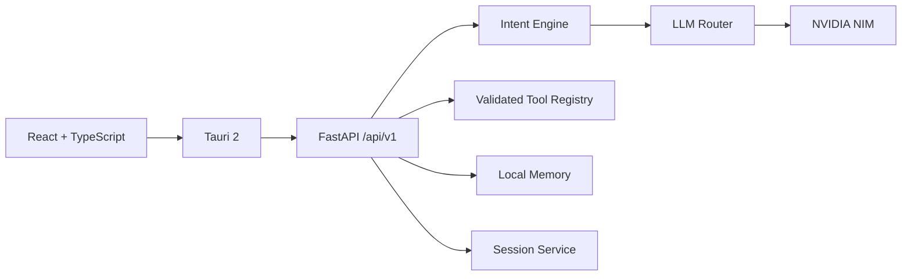

# SoulOS Architecture

SoulOS is a Tauri 2 desktop application with a React/TypeScript UI and a local FastAPI orchestration service. The desktop shell owns native integration while FastAPI owns intent classification, model routing, memory, sessions, and explicit tool execution.

The safety boundary is intentional: raw model output is never treated as an operating-system command. Tools are registered explicitly, arguments are validated with Pydantic, and destructive tools require confirmation.

The desktop client uses `VITE_SOULOS_API_URL` for the local service URL. NVIDIA credentials remain environment-only and are never returned by model or health endpoints.

## Development

Backend: `pip install -r requirements.txt` and run `uvicorn backend.app.main:app --reload`.

Desktop: `cd apps/desktop`, then `npm install` and `npm run dev`. Use `npm run build` for a production frontend check and `npm test` for Vitest.
