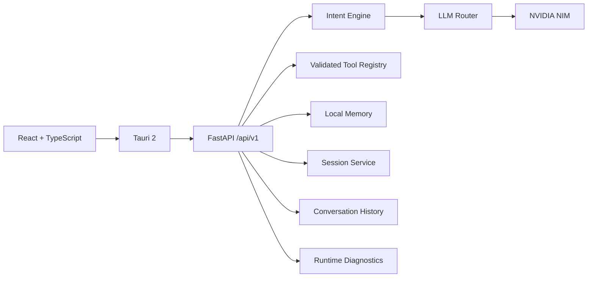

# SoulOS Architecture

SoulOS is a Tauri 2 desktop application with a React/TypeScript UI and a local FastAPI orchestration service. The desktop shell owns native integration while FastAPI owns intent classification, model routing, memory, sessions, conversation history, explicit tool execution, and runtime diagnostics.

```mermaid
flowchart LR
  UI[React + TypeScript] --> TAURI[Tauri 2]
  TAURI --> API[FastAPI /api/v1]
  API --> INTENT[Intent Engine]
  INTENT --> ROUTER[LLM Router]
  ROUTER --> NIM[NVIDIA NIM]
  API --> TOOLS[Validated Tool Registry]
  API --> MEMORY[Local Memory]
  API --> SESSION[Session Service]
  API --> CONVERSATION[Conversation History]
  API --> DIAGNOSTICS[Runtime Diagnostics]
```

The API boundary adds a generated or client-supplied `X-Request-ID` to every HTTP response. This gives the desktop shell a stable correlation key for failures and tool activity.

The safety boundary is intentional: raw model output is never treated as an operating-system command. Tools are registered explicitly, arguments are validated with Pydantic, and destructive tools require confirmation.

Conversation history is scoped to a session and is used to provide recent conversational context to generation. The service currently keeps this state in process memory, so persistence beyond a backend restart is intentionally not yet part of the runtime contract.

Runtime diagnostics expose only non-secret operational metadata: service/version/API identity, configured environment, CORS origins, configured model counts, and readiness counts. NVIDIA API keys are never included.

Desktop development origins are controlled by `SOULOS_CORS_ORIGINS`. The desktop client uses `VITE_SOULOS_API_URL` for the local service URL. `SOULOS_ENVIRONMENT` identifies the runtime environment. NVIDIA credentials remain environment-only and are never returned by model, health, or diagnostics endpoints.
